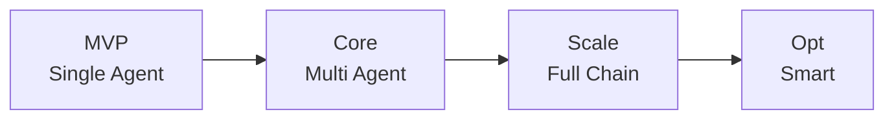

# Supply Chain Agent System

A production-ready AI Agent system for supply chain fulfillment, built with Claude Code native capabilities.

## Overview

This project implements a **Router + Sub-Agents** architecture for supply chain management, featuring:

- **Intent Recognition**: Automatic routing of user messages to appropriate agents
- **Inventory Management**: Real-time warehouse stock queries and allocation
- **Route Planning**: Logistics cost and time optimization
- **Exception Handling**: Automated anomaly detection and resolution
- **Notification System**: Multi-channel alerts (WeChat/Email/DingTalk)

## Architecture

```
User → WeChat Bot → Router Agent → Sub-Agents → MCP Server (Mock APIs)
```

### Agent Components

| Agent | Responsibility |
|-------|----------------|
| Router Agent | Intent recognition, task routing |
| Inventory Agent | Warehouse stock queries |
| Routing Agent | Logistics planning |
| Exception Agent | Anomaly handling |
| Notification Agent | Multi-channel notifications |

## Quick Start

### 1. Install Dependencies

```bash
pip install -r requirements.txt
```

### 2. Run Tests

```bash
export PYTHONPATH=/path/to/project
pytest tests/ -v
```

### 3. Start MCP Server

```bash
python -m mcp_server.server
# Server runs on http://0.0.0.0:8080
```

### 4. Test API Endpoints

```bash
# Query inventory
curl -X POST http://localhost:8080/api/inventory/query \
  -H "Content-Type: application/json" \
  -d '{"sku": "Q235B, 12mm", "quantity": 50}'

# Calculate route
curl -X POST http://localhost:8080/api/routing/calculate \
  -H "Content-Type: application/json" \
  -d '{"source": "Shanghai", "destination": "Guangzhou", "weight": 30}'
```

## Project Structure

```
.
├── skills/              # Agent skill definitions
├── agents/              # Agent implementations
│   └── supply_chain/    # Supply chain domain agents
├── mcp_server/          # MCP Server (Mock APIs)
│   ├── server.py        # FastAPI server
│   ├── mock_erp.py      # Mock ERP system
│   ├── mock_wms.py      # Mock WMS system
│   └── mock_tms.py      # Mock TMS system
├── bot/                 # WeChat bot integration
├── tests/               # Test suites
├── docs/                # Documentation
├── README.md
├── LICENSE
└── pyproject.toml
```

## Development

### Run All Tests

```bash
PYTHONPATH=. pytest tests/ -v
```

### Add New Agent

1. Create skill definition in `skills/<agent_name>/skill.md`
2. Implement agent in `agents/supply_chain/<agent_name>.py`
3. Add tests in `tests/test_<agent_name>.py`
4. Register agent in Router Agent's task routing

## Testing

```bash
# Unit tests
pytest tests/test_router.py -v

# Integration tests
pytest tests/test_integration.py -v

# All tests
pytest tests/ -v --tb=short
```

## Metrics

- Task Completion Rate ≥ 85%
- Intent Recognition Accuracy ≥ 90%
- Tool Call Success Rate ≥ 95%

## License

MIT License - see [LICENSE](LICENSE) file for details.

## Project Status

### Completed ✅

| Module | Function | Status | Notes |
|--------|----------|--------|-------|
| **Router Agent** | Intent recognition, task routing | ✅ Done | Supports 5 intents: inventory/route/exception/notify/data |
| **Inventory Agent** | Warehouse stock queries | ✅ Done | Mock mode, multi-warehouse support |
| **Routing Agent** | Logistics planning | ✅ Done | 3 transport types: highway/rail/water |
| **Exception Agent** | Anomaly handling | ✅ Done | 4 exception types: delay/refuse/damage/missing |
| **Notification Agent** | Multi-channel notifications | ✅ Done | WeChat/DingTalk/Email support |
| **MCP Server** | Mock API services | ✅ Done | FastAPI with ERP/WMS/TMS simulation |
| **WeChat Bot** | WeChat integration | ✅ Done | Message handling & event triggering |
| **Test Suite** | Unit/Integration tests | ✅ Done | 29 test cases, all passing |
| **CI/CD** | GitHub Actions | ✅ Done | CI build + CodeQL security scan |
| **Open Source** | LICENSE/Docs | ✅ Done | MIT license, EN/CN README |

### To Do 🔄

| Module | Function | Priority | Notes |
|--------|----------|----------|-------|
| **Data Agent** | Data recording & persistence | P1 | Currently placeholder |
| **Real System Integration** | ERP/WMS/TMS real APIs | P1 | Replace Mock with real systems |
| **Customer Profiling** | Customer data analytics | P2 | Precision marketing support |
| **Price Prediction** | AI dynamic pricing | P2 | Demand forecasting model |
| **Smart Customer Service** | Multi-turn conversation | P2 | RAG knowledge base enhancement |
| **Risk Control Agent** | Credit assessment/anti-fraud | P2 | Financial scenario |
| **Cross-border Service** | Multi-language/compliance | P3 | International support |
| **HITL Approval** | Human confirmation nodes | P2 | Key decision human intervention |
| **RAG Knowledge Base** | SOP/Historical cases | P2 | Agent capability enhancement |
| **Model Routing** | Auto-select large/small models | P3 | Cost optimization |
| **Visual Debugging** | LangSmith integration | P3 | Observability enhancement |
| **Performance Monitoring** | Grafana dashboards | P3 | Production monitoring |

### Technical Evolution Roadmap

| Phase | MVP | Core | Scale | Opt |
|-------|-----|------|-------|-----|
| Name | Single Agent | Multi Agent | Full Chain | Smart |
| Duration | 1-2mo | 3-4mo | 5-6mo | 6-12mo |

### Technical Evolution Roadmap（Mermaid）



## Contributing

Contributions are welcome! Please feel free to submit issues and pull requests.

## Contact

GitHub: [dalianmao000/SteelEngine](https://github.com/dalianmao000/SteelEngine)